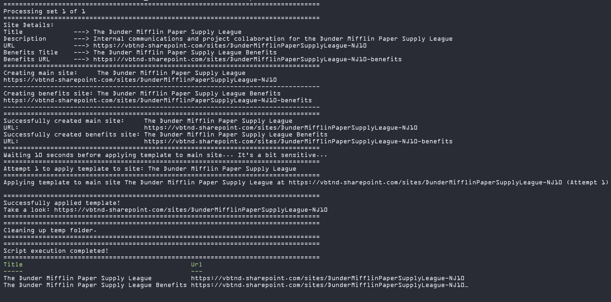

# Masamune Industries SharePoint Site Provisioning

## Overview

This project contains a PowerShell script designed to automate the provisioning of SharePoint sites using PnP (Patterns and Practices) templates. The script leverages the SharePoint Online Management Shell and PnP PowerShell modules to create multiple sites efficiently while applying a predefined template to each site. The script is designed to be flexible and customizable, allowing users to specify the number of sites to create, the site names, URLs, and descriptions, and the template to apply to each site. The script also includes retry logic to handle any errors that could occur during site creation.

## Features

- Creates multiple SharePoint sites with customized names and URLs.
- Applies PnP template/s to each site.
- Implements retry logic to handle any errors.
- Customizable site titles, descriptions, and URLs based on predefined department and committee names.

## Screenshot


 _Screenshot of the script execution in PowerShell terminal_


_Screenshot of the hub site applied by the script_


_Screenshot of the subsite applied by the script_


_Screenshot of the script retrying after an error_

## Prerequisites

- [PowerShell 5.1 or later](https://docs.microsoft.com/en-us/powershell/scripting/install/installing-powershell)
- [PnP.PowerShell module](https://pnp.github.io/powershell/articles/installation.html)
- [NameIT module](https://www.powershellgallery.com/packages/NameIT)
- [SharePoint Online tenant with Administrative Access](https://www.microsoft.com/en-au/microsoft-365/enterprise/microsoft365-plans-and-pricing) </br>
  [*Offers 1 month free trials.. but remember to cancel the subscription before the trial ends*]

## Setup

1. **Clone the repository**:
   ```bash
   git clone https://github.com/TimBroderick44/Masamune_Industries
   cd Masaume_Industries
   ```
2. **Set up SharePoint Online Tenant**:
   - Create a SharePoint Online tenant if you don't have one.
   - Create a SharePoint site to store the PnP templates (Can do through the SharePoint Admin Center or via [Powershell](https://pnp.github.io/powershell/cmdlets/New-PnPSite.html) - _make sure that the module is first installed!_).
   - Once created, go to the site contents of the new site (top of the page), create a new 'document library' and upload the 'contosoworks.pnp' file here.
   - **Alternatively**, work with the 'contosoworks.pnp' locally.
3. **Install required modules (Optional as included in the script)**:
   ```bash
   Install-Module -Name PnP.PowerShell -Scope CurrentUser -Force -AllowClobber
   Install-Module -Name NameIT -Scope CurrentUser -Force -AllowClobber
   ```
4. **Implement Variables and Run the Script**:
   - Open the `CreateSites.ps1` script.
   - Customize and/or confirm the variables at the top of the script as needed (_See below for usage_).
   - Through the PowerShell terminal, go to the directory with the 'CreateSites.ps1' file and run the script (_i.e. the cloned repo from step 1_).
   ```bash
   .\CreateSites.ps1
   ```

### Variables

The `CreateSites.ps1` script has the following variables that can be customized:

- **`$numSites`**: _(int)_ Number of sites to create. Default is 5.  
  Example: `-numSites 10`

- **`$tenantUrl`**: _(string)_ URL of your SharePoint tenant.  
  Example: `-tenantUrl "https://masamuneindustries.sharepoint.com"`

- **`$templateSite`**: _(string)_ URL of the site where the template is stored.  
  Example: `-templateSite "https://masamuneindustries.sharepoint.com/sites/PNPTemplates"`
- **`$templateUrl`**: _(string)_ **COMPLETE** URL of the PnP template **file**.  
  Example: `-templateUrl "https://masamuneindustries.sharepoint.com/sites/PNPTemplates/PNP_Templates/contosoworks.pnp"`
- **`$templateFilePath`**: _(string)_ **RELATIVE** Path to the PnP template file within the SharePoint site.  
  Example: `-templateFilePath "/sites/PNPTemplates/PNP_Templates/contosoworks.pnp"`
- **`$localTemplatePath`**: _(string)_ Local path to store the downloaded template file.  
  Example: `-localTemplatePath "C:\temp\contosoworks.pnp"`
- **`$tempFolderPath`**: _(string)_ Temporary folder path to store the pnp file temporarily.  
  Example: `-tempFolderPath "C:\temp"`
- **`$siteOwner`**: _(string)_ Owner of the newly created sites.
  Example: `-siteOwner "BobBobson@mYourTenant.onmicrosoft.com"`

## Challenges and Lessons:

- **PowerShell Scripting**: At first, I was unfamiliar with PowerShell scripting, but after working on this project, I have gained a much stronger understanding of the language and its capabilities. Even beyond the scope of this project, it'll be applicable to other tasks and projects in the future.
- **PnP Templates**: Gained experience in working with PnP templates for SharePoint. Specifically, the structure of XML files and its syntax. I still have some difficulties understanding how it goes through the XML and applies it to the screen. With practice, I'll get there; however, for now, I much prefer traditional front-end development (i.e. React with TypeScript).
- **Azure Integration**: Explored methods for automating processes with Azure services. For example, Azure Functions or Power Automate (Not implemented in this project... _yet_...)
- **Error Handling**: Trying to get more verbose and expletive error handling in the script. This was a challenge as when errors arose, it was often difficult to pinpoint the exact cause and/or get detailed error messages. To date, I still have CSOM errors and am not sure how to get more verbose or accurate information on how to resolve these kinds of errors.

## Future Improvements

- **Batching and Asynchronous Processing**: Implement batching and asynchronous processing to create sites more efficiently. I did try to implement this, but there were issues with throttling. It's definitely something that I'll be revisiting.
- **Scalability**: Optimize the script for better performance with large-scale site creation. For example, create a wider variety of templates for different departments and committees.
- **Customization**: Add more customization options for site creation and template application.
- **Automation**: Research and implement automation for the script using Azure Functions or Power Automate.
- **Error Handling**: Research improving error handling and logging to provide more detailed information on errors and how to resolve them.

## Contact

Feel free to reach out to me with any questions, suggestions, or feedback!

Happy provisioning! 🚀
